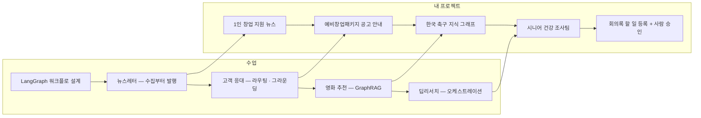

이 블로그는 배운 개념을 **내 나름대로** 정리해 두는 곳이다. 교재 문장을 옮기는 대신, 내가 이해한 말로 다시 적고 내 일에 대 본다.

오늘 사람 승인 에이전트를 제출하면서 **에이전트 팀 꾸리기** 모듈의 열 노드가 끝났다. 수업 다섯, 그걸 받아 내 주제로 만든 프로젝트 다섯이다.

먼저 솔직하게 적어 둔다. 이번 모듈은 처음부터 끝까지 이해하면서 만들었다기보다, **실습을 돌려 보고 결과를 본 뒤에 이해한 것**이 많았다.
과제 내용만 보고 혼자 작업하는 게 쉽지 않다는 것도 느꼈다. 그래서 나는 이번 모듈을 과제 결과보다 **여러 번 시도했다는 것**에 의미를 둔다.

블로그도 중간에 끊겼다. 수업 넷과 뉴스레터 프로젝트까지는 글로 남겼지만, 고객 응대 · 영화 추천 · 딥리서치 프로젝트와 딥리서치 수업은 저장소에만 있다. 이 글이 그 빈칸을 한 번에 메운다.

## 1. 열 노드를 한 장에

## 2. 개념 여섯 개 — 내 일에 대 보고, 해 보고 나서 안 것

개념마다 내가 이해한 대로 적고, 내 일이라면 어디에 쓸지 대 본 다음, 해 보고 나서 안 것을 붙인다.
마지막 부분이 이번 모듈의 진짜 기록이다. 대부분 결과를 보고 나서야 알게 된 것들이라서.

### 워크플로

일을 단계로 쪼개고, 다음에 어디로 갈지를 내가 코드로 정해 두는 것이다. 순서까지 모델에게 맡기면 어디서 틀렸는지 찾기가 어려워진다.
내 일로 치면, 시니어 AI 교육을 운영할 때 「신청 받기 → 반 나누기 → 안내 보내기」 순서는 내가 정하고 모델은 안내 문구만 쓰게 하는 것이다.

첫 수업 날 이렇게 적었다([붙여넣기로는 남지 않았다](/blog/posts/pasting-left-nothing/)).

> 같은 재료로 만드는데 **판단을 어디까지 넘기느냐**만 다른 것 같다.

그날은 "것 같다"였다. 프로젝트를 다섯 개 하고 나니, 이게 매번 가장 먼저 정해야 하는 것이었다.

### 검수

만든 결과를 내보내기 전에 원문과 맞는지 따로 한 번 더 보는 단계다. 요약이 틀려도 오류는 나지 않고 화면에는 멀쩡하게 찍히기 때문에, 이 단계가 없으면 틀린 줄도 모른다.
교육생에게 보낼 안내문이라면, 날짜와 장소가 공지 원문과 같은지를 보내기 전에 대조하는 자리다.

뉴스레터 과제에서 틀린 요약을 일부러 넣어 봤다. 처음엔 3/8이었는데, 틀린 걸 못 잡은 게 아니라 **맞는 요약까지 떨어뜨리고 있었다.** 원인은 LLM이 아니라 내가 넣은 글자 대조였다.
고친 뒤 8/8이 됐고, 그날 이렇게 적었다([채택이 한 곳뿐이었다](/blog/posts/only-one-source-passed/)).

> 고친 방향은 매번 같았다. **LLM은 판단하고, 코드는 대조한다.**

### 라우팅 · 그라운딩

라우팅은 질문을 먼저 갈래로 나누고 갈래마다 다른 처리를 붙이는 것이고, 그라운딩은 정해 둔 자료 안에서만 답하게 하는 것이다. 모든 질문을 한 번에 받으면 자료에 없는 것까지 그럴듯하게 지어내기 쉽다.
어르신용 챗봇이라면 질문을 「기기 사용 · 복지 제도 · 수업 일정」으로 먼저 나누고, 복지 제도는 공지문에 있는 금액과 날짜만 말하게 하고, 없으면 지어내지 않고 담당자에게 넘기는 식이다.

프로젝트는 예비창업패키지 공고문 한 건만 근거로 답하게 만들었다. 넘기는 자리가 분류 · 답변 · 검증 세 곳이었다.
상위 모델로 바꾼 판은 오히려 지표가 떨어졌고, 답변 규칙을 고친 판이 올랐다. 문제는 모델이 아니라 내가 쓴 규칙이었다.
수업 실습에서는 무료 모델로 갈아타려다 연결에서 막혔는데, 그날 본 것도 결국 같은 쪽이었다.

> **코드는 OpenAI 모델이 할 법한 동작을 조용히 전제하고 있었다.**

### GraphRAG

문서를 조각으로 찾는 대신, 문서 속 사실을 점과 선으로 엮어 두고 선을 따라가며 답을 모으는 것이다. 답이 여러 문서에 흩어져 있으면 조각 검색으로는 반쪽만 나온다.
네트워크 운용 쪽으로 보면 장비 · 회선 · 고객이 엮인 구성도가 곧 그래프다. 「이 회선이 끊기면 영향받는 고객은?」은 한 문서에 없고, 연결을 두세 번 타야 나온다.

수업 날 가장 오래 남은 건 이 문장이었다([옵시디언에서 이미 하고 있었다](/blog/posts/already-doing-it-in-obsidian/)).

> **순위를 아무리 바꿔도, 후보에 아예 없는 건 못 찾는다.**

프로젝트는 영화 대신 한국 축구로 했다. 위키백과 80건으로 그래프를 만들고, 근거가 없으면 모른다고 하게 했다. 평가용 18문항에서 2홉 1.00 · 기본 RAG 0.17이 나왔지만, 18문항이면 한 문항이 5.6%p라서 만점을 성능으로 읽지 않기로 했다.
채점기가 제대로 거절한 답에 0점을 주고 있던 것도 결과를 읽다가 찾았다.

### 오케스트레이션

한 명이 일을 쪼개 여럿에게 나눠 주고, 자기는 요약만 보고 모으는 구조다. 자료가 많으면 한 모델의 창에 다 들어가지 않으니 나눠 읽게 해야 한다.
1인기업으로 치면, 대표가 외주 협력자에게 교안 · 영상 · 모집을 나눠 맡기고 결과의 제목과 요약만 보고 엮는 것과 같다.

시니어 건강 조사팀에서 팀장은 문서 제목과 앞부분만 보고 목차를 짰고, 조사원 넷이 나눠 읽었다. 지표를 여럿 만들었지만 보고서를 크게 바꾼 건 전부 **내가 결과물을 읽고 한 말**이었다. 「네 절이 같은 말을 한다」, 「고혈압은 왜 들어간거야?」 같은 것들이다.

> **지표는 이 중 하나도 잡지 못했다.**

### HITL — 사람 승인

되돌릴 수 없는 일 바로 앞에서 멈추고, 사람이 답하면 멈춘 자리부터 이어 가는 것이다. 기준에 안 걸린 건 사람 없이 끝까지 간다. 전부 사람이 보면 자동화가 아니고, 전부 자동이면 틀린 알림이 그대로 나간다.
네트워크 운용에서 되돌리기 어려운 작업을 계획 승인 뒤에만 하는 것과 같은 자리다.

회의록 7편에서 할 일 76건이 나와 24건은 자동 등록, 52건은 멈췄다. 판단을 LLM에 더 맡긴 판은 놓친 위험이 7건에서 16건으로 늘어 버렸고, 코드가 날짜를 다시 계산해 대조하는 판이 남았다.
남은 숙제는 멈춘 것의 절반이 헛멈춤이라는 것. 3주 전 하네스를 만들 때 이미 이렇게 적어 두었다([테스트는 실패했는데 화면엔 성공이라고 찍혔다](/blog/posts/failed-but-printed-success/)).

> 지금은 파일에 없는 문자열, 허용 목록에 없는 명령, 작업 폴더 밖 경로는 **사람을 부르지 않고 그 자리에서 거부한다.** 승인을 물을 가치가 있는 요청만 화면에 뜬다.

사람을 넣는 것만큼 **사람을 덜 부르는 것**도 설계라는 걸, 이번엔 결과 숫자로 다시 봤다.

## 3. 해 본 것들 — 과제 안에서도, 밖에서도

과제 조건에 없던 시도도 많았다. 됐든 안 됐든 적어 둔다.

| 시도 | 결과 |
|---|---|
| 뉴스레터 소스 열세 곳을 같은 시각에 재기 · 주제 바꾸기 | 주제를 바꾸고서야 선별이 실제로 일을 했다 |
| 고객 응대 실습을 무료 모델로 갈아타기 | 연결에서 세 번 막혀 미리 적어 둔 기준대로 멈췄다 |
| 라우팅 개선안 여러 개를 두 번씩 재기 | 기준에 못 미친 건 채택하지 않았다 |
| 축구 그래프 주제 후보 일곱 개를 먼저 재기 · 측정 세 번 사이에 채점기 고치기 | 수량은 찼는데 주제가 안 맞는 후보를 걸렀다 · 기준은 그대로 두고 채점기만 고쳤다 |
| 딥리서치 설정을 켜고 끄며 여러 번 돌리기 | 숫자는 거의 그대로였고 글이 달라졌다 |
| 노트북 대신 공기계를 서버로 ([글](/blog/posts/always-on-computer-was-at-home/)) | 재시동해도 스스로 뜬다. 오늘 승인 데모도 여기서 공개했다 |
| 사진 한 장으로 에이전트 3D 캐릭터 만들기 ([글](/blog/posts/what-the-photo-did-not-have/)) | 이 방법은 아니었다. 도형 캐릭터로 회의실을 만들었다 |
| 승인 기준을 LLM에 더 맡기기 · 승인함 줄이기 | 앞은 놓친 위험이, 뒤는 빠뜨린 할 일이 늘어 둘 다 버렸다 |

안 된 시도가 절반 가까이다. 그래도 이렇게 해 본 것이 **나중에라도 나쁘지 않다**고 생각한다. 안 되는 길을 한 번 걸어 본 사람은 다음에 그 길 앞에서 덜 헤맨다.

## 4. 이번 모듈에서 세운 내 작업 규칙

혼자 과제를 읽고 하는 게 어려웠던 만큼, 막힐 때마다 규칙을 하나씩 적었다. 이번 모듈에서 생긴 것만 모으면 이렇다.

- **측정보다 기준이 먼저** — 뉴스레터 과제에서. 결과를 보고 기준을 고치면 결과에 기준을 맞추는 셈이 된다
- **재는 도구부터 검증** — 모범 답안과 일부러 만든 오답을 먼저 넣어 본다. 채점기가 틀리면 그 위의 판정이 다 틀린다
- **과제는 원문대로, 수업 구조를 기준선으로** — 라우팅 과제에서. 루브릭만 보고 만들어 제출한 뒤에야 수업 구조를 실험해 봤다
- **평가셋 일부는 내가 직접 쓴다** — AI가 만든 문항만으로는 말투가 바뀌었을 때의 약점이 안 보였다
- **모르겠으면 자료를 근거로 다시 설명받는다** — GraphRAG 수업에서. 짧게 넘어가면 뒤에서 다시 막힌다
- **지금 어디를 작업하는지 먼저 확인한다** — 이번 사람 승인 과제에서. 과제 항목과 작업 단계를 맞춰 놓지 않으면 빠뜨린다

돌아보면 이 규칙들이 "혼자 하기 어렵다"를 버티게 해 준 것 같다. 이해가 결과보다 늦게 오더라도, 기준을 먼저 적어 두면 결과를 보고 나서 제대로 이해할 수 있었다.

## 5. AI가 한 일과 내가 판단한 일

| AI가 한 일 | 내가 판단한 일 |
|---|---|
| 코드 · 측정 · 보고서 초안 | 프로젝트마다 주제를 고르고, 무엇을 더 시도할지 · 어디서 멈출지 정하기 |
| 결과 숫자 정리 | 결과물을 직접 읽고 이상한 곳 짚기 (「네 절이 같은 말을 한다」 등) |
| 이 글의 재료 모으기 · 인용 대조 | 이 글을 과제 결과가 아니라 **시도의 기록**으로 쓰기로 한 것 |

지금은 이해가 안 되는 것도 있다. 그게 너무 오래 걸릴 수도 있겠지만, 언젠가는 **이해하며 말하는 날**이 오겠지.

다음은 온담이 본선 진출 고도화 작업을 진행한다.
